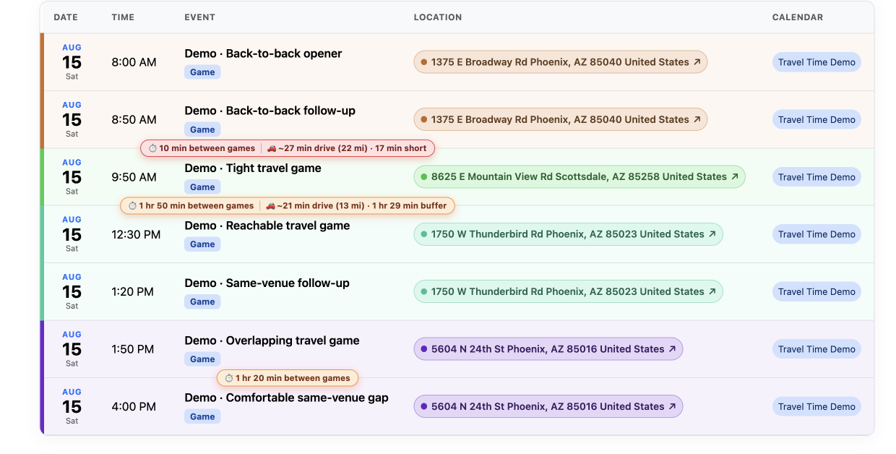

<p align="center">
  
</p>

<p align="center">
  <strong>Your sports calendars, games, locations, and travel plans in one mobile-friendly view.</strong>
</p>

<p align="center">
  <a href="#features">Features</a>
  ·
  <a href="#local-setup">Local setup</a>
  ·
  <a href="#technology">Technology</a>
</p>

<p align="center">
  
  
  
  
</p>

<p align="center">
  
</p>
<p align="center"><sub>Demo data showing location colors, game gaps, and travel estimates.</sub></p>

## Why Gcal?

Sports schedules rarely live in one place. A team may use one calendar, a league
another, and a tournament organizer something else. Finding the next game can mean
switching between apps and browser tabs just to answer three simple questions:
**When is it? Where is it? How long will it take to get there?**

Gcal brings compatible iCalendar feeds together into one schedule. It is designed
to be easy to scan on a phone, opens locations directly in Google Maps, and can
estimate driving time, distance, and the usable buffer between games.

## Features

- **One schedule** — import multiple ICS calendars and see their events together.
- **Mobile friendly** — compact event cards make dates, times, venues, and teams easy
  to scan on the go.
- **Useful event views** — keep Games and Practices within the current Monday–Sunday
  week, filter Games and All by ownership, and use All to browse every upcoming event.
- **Smart classification** — classify games, practices, tournaments, and other events
  automatically, with custom rules for each calendar.
- **Schedule cross-checking** — match your team in official league feeds and flag time
  or location conflicts between copies of the same game.
- **Directions in one tap** — open a venue in Google Maps, including directions from
  the previous game when the location changes.
- **Travel estimates** — use Geoapify to estimate drive time, distance, and the buffer
  available between same-day games.
- **Calendar management** — preview before importing, replace a calendar’s stored
  events from a fresh feed, disable calendars, edit classification rules, and inspect
  calendar statistics.
- **Saved links** — keep useful schedule URLs with optional names, manage them inline
  with the calendar list, and open them from a link section at the bottom of the page.
- **Recurring events** — expand recurring ICS events into individual schedule entries.
- **Efficient API usage** — cache successful route estimates for 30 days and limit new
  route requests per page load.
- **Arizona time** — interpret and display schedules in `America/Phoenix`, which does
  not observe daylight saving time.

Calendar imports cover events from the previous 30 days through the next year.
Games are treated as 50 minutes long when calculating between-game gaps.

## Technology

| Component | Version | Purpose |
| --- | ---: | --- |
| [Python](https://www.python.org/) | **3.14.6** | Application runtime |
| [Django](https://www.djangoproject.com/) | **6.1** | Web framework, ORM, forms, and administration |
| [SQLite](https://sqlite.org/) | **3.53.1** | Application database |
| [Bootstrap](https://getbootstrap.com/) | **5.3.3** | Responsive user interface |
| [django-allauth](https://allauth.org/) | **65.19.0** | Email-based accounts and authentication |
| [Gunicorn](https://gunicorn.org/) | **25.3.0** | Production WSGI server |
| [WhiteNoise](https://whitenoise.readthedocs.io/) | **6.12.0** | Production static-file serving |
| [icalendar](https://icalendar.readthedocs.io/) | **7.2.2** | ICS parsing |
| [recurring-ical-events](https://recurring-ical-events.readthedocs.io/) | **3.8.2** | Recurring-event expansion |
| [Geoapify](https://www.geoapify.com/) | API | Geocoding and route estimates |
| [uv](https://docs.astral.sh/uv/) | **0.12.3** | Python and dependency management |

### Initial template

Gcal was originally scaffolded from William Vincent's open-source
[Lithium](https://github.com/wsvincent/lithium) Django starter. Lithium follows a
rolling `main` branch and does not publish numbered releases, so there is no template
version to report. The application has since been substantially extended for calendar
imports, event classification, mobile schedules, and travel planning.

## Local setup

Requirements: `uv` and a platform supported by Python 3.14.6.

```console
uv sync
cp .env.example .env
uv run python manage.py migrate
uv run python manage.py createsuperuser
uv run python manage.py runserver
```

Open <http://127.0.0.1:8000/>.

Add a Geoapify project key to `.env` to enable geocoding and travel estimates:

```console
GEOAPIFY_API_KEY=your-project-key
```

When debug mode is enabled, **Populate Demo** creates a repeatable seven-game travel
scenario using locations already stored in the database. The development-only
**API Logs** page shows redacted Geoapify requests, responses, timing, and usage
statistics.

## Tests

```console
uv run python manage.py check
uv run python manage.py test
```

## Docker

```console
docker compose up --build
```

The default SQLite database is stored in `db.sqlite3` at the project root.

## Production configuration

Keep production configuration and secrets in environment variables or an untracked
`.env` file:

```console
DJANGO_DEBUG=0
DJANGO_SECRET_KEY=replace-with-a-random-secret
DJANGO_ALLOWED_HOSTS=g.example.com
DJANGO_CSRF_TRUSTED_ORIGINS=https://g.example.com
GAMESCAL_ACCESS_PASSWORD_HASH=django-password-hash
GEOAPIFY_API_KEY=optional-provider-key
```

Generate the shared-access password hash without placing the plaintext password
in shell history:

```console
uv run python manage.py shell -c \
  'from getpass import getpass; from django.contrib.auth.hashers import make_password; print(make_password(getpass("Shared password: ")))'
```

The password-only gate protects every application route and gives each device a
one-year session whose expiry rolls forward on use. Changing the configured hash
invalidates existing sessions.

Gunicorn can serve the application behind an HTTPS reverse proxy such as Caddy.
Never commit `.env`, API keys, databases, calendar exports, or personal event data.

## Current limitation

Gcal imports iCalendar/ICS feeds. XML calendar feeds are not supported because they
require a provider-specific schema and parser.
